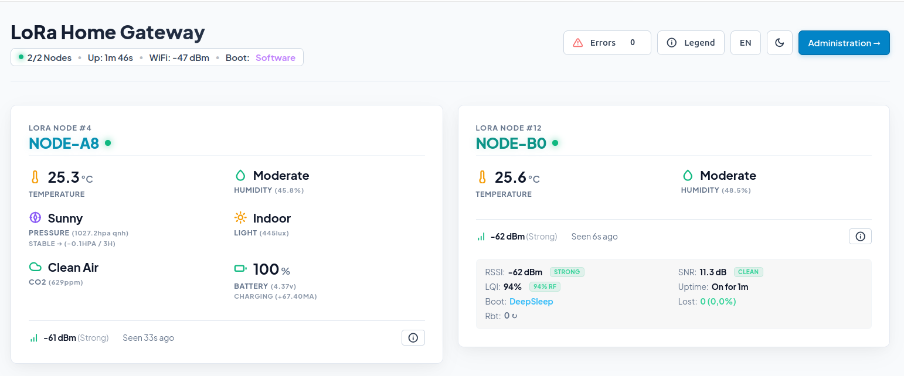

# LoRa@Home — Secure ESP32 LoRa Telemetry System

[](LICENSE)
[](https://www.espressif.com/)
[](doc/hardware.md)
[](doc/security.md)
[](doc/architecture.md)

An end-to-end, privacy-focused home telemetry network featuring a modular **ESP32-C6 Web Gateway** and configurable **ESP32-C3 Sensor Client Nodes**. Sensor measurements are securely transmitted over **LoRa** using authenticated **AES-128 GCM** encryption.

The Gateway exports **Prometheus metrics** (`/metrics`) for Grafana visualization, serves a live diagnostic dashboard, and handles seamless wireless **Web Bluetooth (BLE) provisioning** directly from modern web browsers.

---

## Interface Preview



---

## Key Features

- **Authenticated AES-128 GCM Encryption**: Hardware-accelerated cryptographic protection with 96-bit IVs and 32-bit auth tags preventing spoofing and replay attacks.
- **Long-Range LoRa Protocol**: Custom binary protocol (`shared_protocol.h`) optimized for low bandwidth, range, and battery efficiency.
- **Web Gateway & Diagnostics**: Embedded Web UI on ESP32-C6 for real-time node monitoring, signal strength (RSSI/SNR), packet counters, and configuration.
- **Prometheus Integration**: Exposes standard `/metrics` endpoint for Grafana visual dashboards, alerts, and time-series history.
- **Browser BLE Provisioning**: Provision WiFi credentials, AES security keys, and Node/Gateway settings via Web Bluetooth directly in Chrome/Edge without needing custom apps.
- **Plug & Play Sensor Auto-Discovery**: Client nodes dynamically detect connected I2C sensors at startup (AHT20, BMP280, TSL2561, SCD40/SCD41, INA226).
- **Dynamic NVM Storage**: Persistent parameter management using ESP32 Preferences/NVM storage.
- **Low Power Ready**: Deep sleep state support on sensor client nodes for battery-powered operations.

---

## Quick Start (Build & Flash)

### 1. Prerequisites
Install [`arduino-cli`](https://arduino.github.io/arduino-cli/) globally:

```bash
curl -fsSL https://raw.githubusercontent.com/arduino/arduino-cli/master/install.sh | BINDIR=~/.local/bin sh
```

Install ESP32 core and required libraries:
```bash
# Update index and install core
arduino-cli core update-index
arduino-cli core install esp32:esp32

# Install required library dependencies
arduino-cli lib install "RadioLib" "Crypto" "Adafruit SSD1306" "Adafruit GFX Library" \
                        "Adafruit AHTX0" "Adafruit BusIO" "Adafruit Unified Sensor" \
                        "NimBLE-Arduino" "ArduinoJson" "NimBLE-DataPipe"
```

### 2. Compile & Flash Gateway (`lora-gw`)
```bash
cd lora-gw
make         # Generates web assets & compiles ESP32-C6 firmware
make upload  # Flashes via USB (Default port: /dev/ttyACM0)
```

### 3. Compile & Flash Client Node (`lora-node`)
```bash
cd lora-node
make compile # Compiles ESP32-C3 node firmware
make upload  # Flashes via USB (Default port: /dev/ttyACM0)
```

> [!TIP]
> For advanced build flags, custom serial ports, and monitor usage, refer to [DEVELOPMENT.md](DEVELOPMENT.md).

---

## Complete Documentation

Detailed technical documentation is available in the [`doc/`](doc/) directory:

- [**System Architecture**](doc/architecture.md): Overview of gateway pipeline, node lifecycle, and data flow.
- [**Protocol Specification**](doc/protocol.md): Frame formats, field layouts, scaling factors, and packet parsing rules.
- [**Security Model**](doc/security.md): AES-128 GCM encryption scheme, IV construction, replay prevention, and BLE security.
- [**Hardware & Wiring**](doc/hardware.md): Complete pinout diagrams and schematic wiring tables for Gateway and Node hardware.
- [**Compatible Sensors**](doc/sensors.md): Sensor driver specifications, I2C address map, and instructions for extending sensor support.
- [**Configuration & Provisioning**](doc/configuration.md): Web UI dashboard navigation, BLE Web Bluetooth provisioning workflow, and OTA updates.

---

## License

Distributed under the MIT License. See [`LICENSE`](LICENSE) for details.


