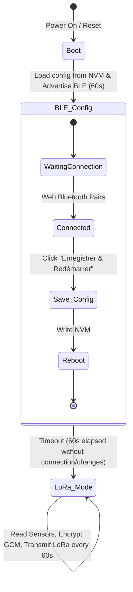

# Configurable Client Node (ESP32-C3 & SX1287/SX1278) — BLE Configuration & Wiring Guide

This directory contains the firmware for the **Configurable LoRa Client Node** based on an **ESP32-C3** microcontroller and a **SX1278** radio. 

Rather than hardcoding parameters, this node stores its configuration (ID, name, frequency, spreading factor, bandwidth, AES encryption key) inside the ESP32's non-volatile memory (NVM). At boot, it exposes a **Web Bluetooth (BLE) interface** allowing complete reconfiguration from a static web page without flashing!

---

## 🔄 Boot Cycle & Operation Workflow



1. **Boot**: The ESP32-C3 reads configuration parameters from NVM. If empty, it loads default values.
2. **BLE Config Mode**: For the **first 60 seconds** after boot, the node advertises its Bluetooth service as `ESP32-LoRa-Config`.
   * Open the included `index.html` in Chrome/Edge, pair, read the settings, change them, and save.
   * If a client is connected, the 60 seconds timer is suspended.
3. **LoRa Mode**: After a save-and-reboot, or if 60 seconds elapse with no connection, the BLE stack is completely shut down and de-initialized (freeing up 40KB of RAM). The I2C sensor (AHT20) and LoRa radio are initialized with the loaded parameters, and normal telemetry transmission begins.

---

## 🛠️ 1. Wiring Diagrams

### 1.1 LoRa Module (SX1278) Connection
Connect the SPI and DIO0 pins of the SX1278 module to the hardware interface of the ESP32-C3:

```
       +------------------------------------+
       |             ESP32-C3               |
       |                                    |
       |   3V3  GND  IO6  IO2  IO7  IO10    |
       +----+----+----+----+----+----+------+
            |    |    |    |    |    |     
            |    |    |    |    |    +-----------------+
            |    |    |    |    +----------------+     |
            |    |    |    +---------------+     |     |
            |    |    +--------------+     |     |     |
            |    |                   |     |     |     |
       +----+----+-------------------+-----+-----+-----+---+
       |   VCC  GND                 SCK   MISO  MOSI  NSS  |
       |                                                   |
       |                  SX1278 LoRa Module               |
       |                                                   |
       |   RST  DIO0                                       |
       +----+----+-----------------------------------------+
            |    |                                         
            |    +-------------------+                     
            +-------------------+    |                     
                                |    |                     
                            +---+----+---------------------+
                            |  IO0  IO8                    |
                            |            ESP32-C3          |
                            +------------------------------+
```

| LoRa Module Pin | ESP32-C3 Pin | Definition in Code | Description |
|:---|:---|:---|:---|
| **VCC** | `3V3` | - | 3.3V Power Supply (do not connect to 5V) |
| **GND** | `GND` | - | Ground reference |
| **SCK** | `GPIO 6` | `SPI_SCK` | SPI Clock line |
| **MISO** | `GPIO 2` | `SPI_MISO` | SPI Master Input Slave Output |
| **MOSI** | `GPIO 7` | `SPI_MOSI` | SPI Master Output Slave Input |
| **NSS / CS** | `GPIO 10` | `LORA_CS` | SPI Chip Select |
| **RST / RESET** | `GPIO 0` | `LORA_RST` | Reset control pin |
| **DIO0** | `GPIO 8` | `LORA_DIO0` | Interrupt output |

---

### 1.2 I2C Sensors (AHT20, BMP280, TSL2561) Connection
Multiple I2C sensors can be connected in parallel on the same physical lines (VCC, GND, SDA, SCL) since I2C is an addressable bus protocol. The firmware automatically scans the bus and enables whichever sensors are present.

```
       +-----------------------------------------------------------+
       |                          ESP32-C3                         |
       |                                                           |
       |                 3V3   GND   IO3   IO4                     |
       +------------------+-----+-----+-----+----------------------+
                          |     |     |     |
             +------------+     |     |     +-------------+
             |  +---------+     |     +-------------+     |
             |  |               |                   |     |
       +-----+--+---------------+-------------------+-----+----+
       |    VCC GND                                SDA   SCL    |
       |                     Capteur AHT20                      |
       +--------------------------------------------------------+
             |  |               |                   |     |
       +-----+--+---------------+-------------------+-----+----+
       |    VCC GND                                SDA   SCL    |
       |       Capteur BMP280 (CSB -> 3V3, SDO -> GND/3V3)      |
       +--------------------------------------------------------+
             |  |               |                   |     |
       +-----+--+---------------+-------------------+-----+----+
       |    VCC GND                                SDA   SCL    |
       |                 Capteur TSL2561 (INT -> NC)            |
       +--------------------------------------------------------+
```

| Pin Capteur | Connexion ESP32-C3 | Description / Rôle |
|:---|:---|:---|
| **VCC** | `3V3` (3.3V) | Alimentation positive (commune à tous les capteurs) |
| **GND** | `GND` | Masse (commune à tous les capteurs) |
| **SDA** | `GPIO 3` (`I2C_SDA`) | Ligne de données I2C (partagée) |
| **SCL** | `GPIO 4` (`I2C_SCL`) | Ligne d'horloge I2C (partagée) |

#### Raccordements spécifiques pour le BMP280 :
* **CSB (Chip Select Bar)** : Laisse-le **non connecté (NC)** ou relie-le au **3.3V**. Cela force le capteur à fonctionner en mode **I2C**. *(Le relier à la masse forcerait le mode SPI, ce qu'on ne veut pas).*
* **SDO (Serial Data Out)** : Permet de choisir l'adresse I2C du capteur.
  * Relie-le à la **GND** pour forcer l'adresse `0x76`.
  * Laisse-le **non connecté** ou relié au **3.3V** pour avoir l'adresse `0x77`.
  *(Le firmware scanne les deux adresses, donc les deux branchements fonctionnent !)*

#### Raccordement spécifique pour le TSL2561 :
* **INT (Interrupt)** : Laisse-le **non connecté (NC)**. Il s'agit d'une pin d'interruption matérielle que notre firmware n'utilise pas.

---

## 📦 2. Environment Setup (Prerequisites)

Run these commands to install the necessary libraries for this node:

```bash
arduino-cli lib install "RadioLib"
arduino-cli lib install "Crypto"
arduino-cli lib install "Adafruit AHTX0"
arduino-cli lib install "Adafruit BusIO"
arduino-cli lib install "Adafruit Unified Sensor"
arduino-cli lib install "NimBLE-Arduino"
arduino-cli lib install "ArduinoJson"
arduino-cli lib install "NimBLE-DataPipe"
```

---

## 🚀 3. Compile and Upload (USB Flashing)

We provide a `Makefile` in the `lora-node/` directory to simplify all CLI operations.

### 3.1 Using the Makefile (Recommended)
Navigate to the `lora-node/` directory:
```bash
# Compile the firmware (default target)
make

# Flash the compiled binary via USB
make upload PORT=/dev/ttyACM0

# Start the serial monitor (baudrate 115200)
make monitor PORT=/dev/ttyACM0

# Clean build artifacts
make clean
```

### 3.2 Manual CLI Commands (Reference)
If executing manually, use the following commands:

```bash
# Compile only (Enable USB Serial Output on Boot)
arduino-cli compile --fqbn esp32:esp32:esp32c3:CDCOnBoot=cdc --output-dir ./build lora-node.ino

# Upload via USB
arduino-cli upload -p /dev/ttyACM0 --fqbn esp32:esp32:esp32c3:CDCOnBoot=cdc --input-dir ./build
```

---

## 🌐 4. How to use the BLE Configuration Interface

The static configuration client dashboard is located at `lora-node/index.html`.

1. **Requirements**: 
   * A BLE-capable computer or Android device.
   * Google Chrome, Microsoft Edge, or any browser supporting the **Web Bluetooth API**.
2. **Steps**:
   * Open the local `index.html` file in your browser.
   * Power cycle / Reset your ESP32-C3 node.
   * Click **"Se connecter"** in the web page within 60 seconds of booting the node.
   * Pair with the device named **`ESP32-LoRa-Config`**.
   * The web page will automatically retrieve the current parameters from the node's NVM.
   * Modify parameters (e.g. Node ID, Node Name, LoRa Frequency, or AES Key).
   * Click **"Enregistrer & Redémarrer"**. The node will save parameters to NVM and reboot into LoRa mode!
